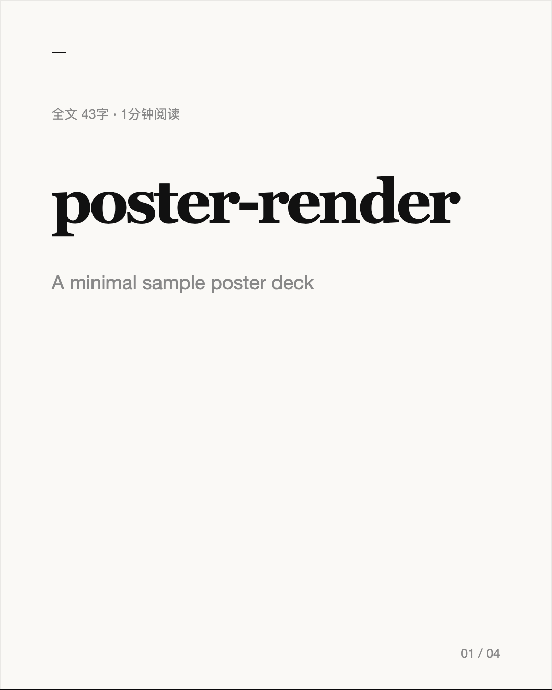
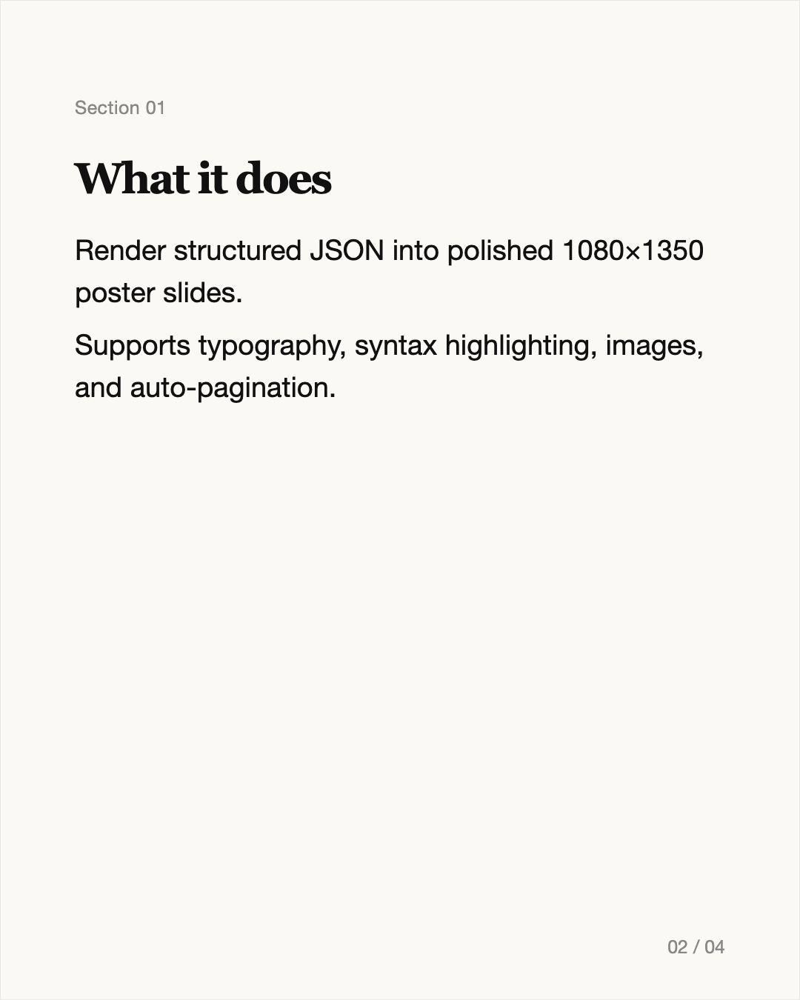
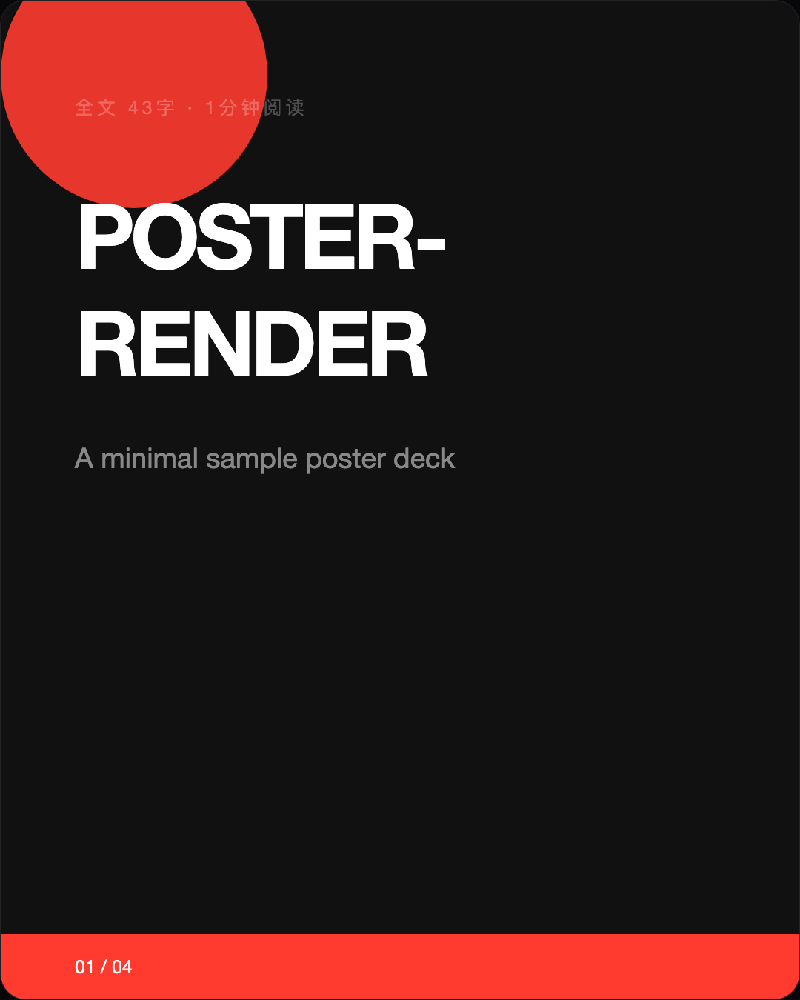
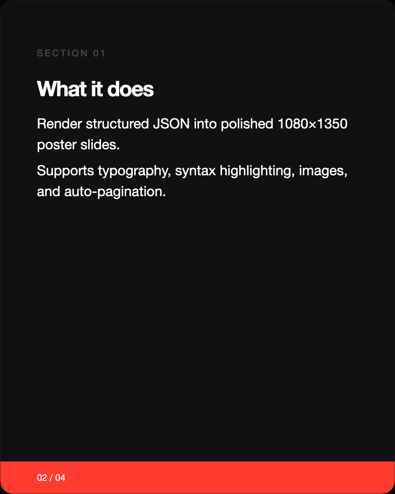
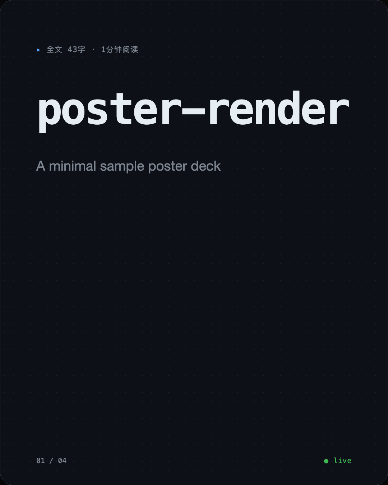
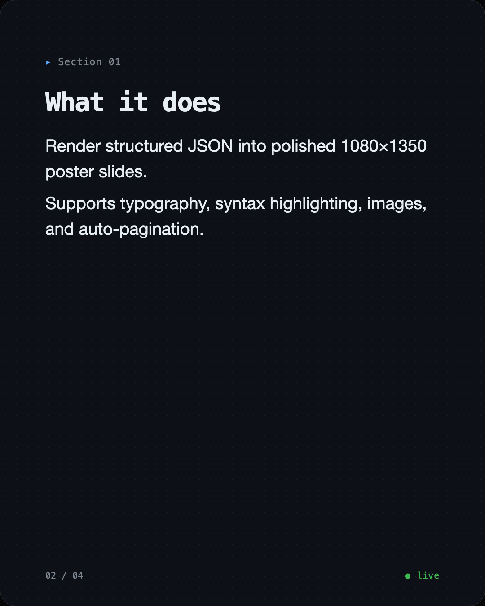

# poster-render

Node.js CLI for rendering poster slides as 1080×1350px PNGs.
Accepts structured JSON or Markdown, outputs one PNG per slide.

MIT licensed. Issues and PRs welcome.

## Install

```sh
pnpm install
```

Requires Node.js 22+ and native canvas dependencies:

- macOS: `brew install pkg-config cairo pango libpng jpeg giflib librsvg pixman`
- Ubuntu/Debian: `sudo apt-get install build-essential libcairo2-dev libpango1.0-dev libjpeg-dev libgif-dev librsvg2-dev`

## Quick start

```sh
poster-render content.json --template bold --output ./slides
```

Or with Markdown input:

```sh
poster-render deck.md --template minimal --output ./slides
```

Agent pipeline (JSON result on stdout):

```sh
poster-render deck.md --template technical --json
```

## Templates

| Template | Feel | Cover | Content |
|----------|------|-------|---------|
| `minimal` | Editorial, thought leadership |  |  |
| `bold` | Campaign, product launches |  |  |
| `technical` | Engineering blog, devtools |  |  |

Live preview with auto-reload:

```sh
pnpm preview:minimal   # http://localhost:3456
pnpm preview:bold
pnpm preview:technical
```

## CLI options

| Flag | Values | Description |
|------|--------|-------------|
| `--template <name>` | `minimal` \| `bold` \| `technical` | Visual template (required for HTML path) |
| `--output <dir>` | any path | Output directory (default: `./output`) |
| `--json` | flag | Write `{"slides":[…],"count":N,"template":"…","output":"…"}` to stdout |
| `--typography <name>` | `sm` \| `md` \| `lg` \| `golden-ratio` | Override typography scale |
| `--no-cover-kicker` | flag | Hide the auto-generated word count kicker |

## Helpful scripts

```sh
pnpm sample            # render examples/sample-content.json → ./output-sample
pnpm preview:minimal   # live preview at localhost:3456
pnpm preview:bold
pnpm preview:technical
pnpm test
pnpm lint
```

## content.json schema

```jsonc
{
  "cover": {
    "title": "Slide title",
    "subtitle": "Optional subtitle",
    "kicker": "Optional top line; auto-generated by default",
    "showKicker": true,
    "coverImage": "path/to/image.jpg",
    "coverStyle": "card"                 // "card" | "fluid" | "inset"
  },
  "sections": [
    {
      "headline": "Section heading",
      "body": "Body text.\n\nSupports multiple paragraphs.",
      "image": "path/to/image.jpg",      // optional
      "imageAspect": "16/9",             // "16/9" | "4/3" | "1/1" | "free"
      "imagePosition": "top"             // "top" | "center" | "bottom"
    }
  ],
  "cta": "Closing call-to-action text",
  "tags": "#hashtag1 #hashtag2"
}
```

Sections are **auto-paginated** — if a section body is too tall for one slide it splits automatically. Sections with images start a new slide.

The cover kicker is auto-generated as `全文 {字数}字 · {阅读时间}分钟阅读`. Disable with `cover.showKicker: false`.

### Section body syntax

Inline code and fenced code blocks are supported:

````
"body": "Use `const` for immutable bindings.\n\n```js\nconst x = 1;\n```"
````

Supported languages: `js`, `ts`, `python`, `rust`, `go`, `java`, `c`, `cpp`, `html`, `css`, `json`, `bash`, `sql`.

### Custom fonts (optional)

Place `.ttf` or `.otf` files in `./fonts/`. Files are auto-registered by name substring:

| File name contains | Family |
|-------------------|--------|
| `geistmono` | `mono` |
| `geist` | `sans` |
| `helvetica` | `sans` / `Helvetica Neue` |
| `georgia` | `serif` / `Georgia` |
| `menlo` | `mono` / `Menlo` |

For CJK text, install a system font: PingFang SC, Hiragino Sans GB, or Noto Sans CJK SC.

## Contributing

Small patches preferred. Run `pnpm test` and `pnpm lint` before sending a PR.

## License

MIT — see [LICENSE](LICENSE).
